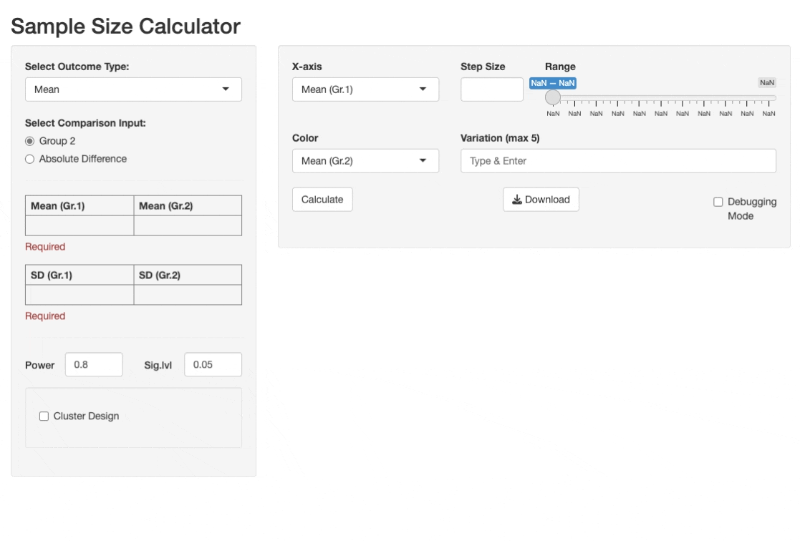

# SampleSizer: A Shiny App for Calculating Sample Size 

Hey there, welcome to the SampleSizer Shiny app! This app is designed to help researchers and statisticians calculate the necessary sample size for a study. It's a bit of a work-in-progress, so sorry in advance for the bugs!

## Features

The SampleSizer app includes the following features:

- Calculation of sample size for mean, proportion, and incidence rate outcomes
- Support for cluster designs
- Support sample size calculation for multiple scenarios 
- Customizable color and x-axis variables for data visualization

## Installation

You can run the SampleSizer app locally by cloning this repository and running the `server.R` or `ui.R` file in RStudio. Alternatively, you can access the app online at [https://songyosr.shinyapps.io/samplesizer/](https://songyosr.shinyapps.io/samplesizer/).

## Usage

To use the app, simply select the outcome type, input method, and other relevant parameters, and then click the "Calculate" button to generate the sample size. The app will display the resulting sample size, along with a reactable data frame and a plotly chart for data visualization.

## Contributing

If you have any feedback or suggestions for the SampleSizer app, please feel free to submit a pull request or raise an issue on the GitHub repository.

## Author

The SampleSizer app was created by [Songyos Rajborirug](https://github.com/songyosr), who's using this project as an excuse to practice with Shiny. If you find any bugs, it's probably because he's still learning.

## License

This project is licensed under the MIT License - see the [LICENSE](LICENSE) file for details.

----

Thanks for checking out the app, and happy calculating!
